# AWS-network-infrastructure-project
A secure, scalable cloud network architecture for a small-to-medium organization, designed for future expansion and hybrid interoperability (cloud and on-premises). The design follows least-privilege access and a layered defense-in-depth security model.

## Table of Contents
- [Project Overview & Scenario](#project-overview-scenario)
- [Implemented vs Planned](#implemented-vs-planned-current-state-vs-target-state)
  - [Implemented Currently](#implemented-currently)
  - [Planned or Future Implementations](#planned-future-implementations)
- [Architecture](#architecture)
- [Walkthrough](#walkthrough-screenshots)
  - [1. AWS Organizations, Organizational Units, and Access](#1-aws-organizations--ous)
  - [2. VPC, Subnets, Endpoints, Routing, SG](#2-vpc-subnets-routing)
  - [3. Edge Delivery: Route 53 + CloudFront + WAF](#3-edge-delivery-route-53--cloudfront--waf)
  - [4. Application Tier: ALB + EC2](#4-application-tier-alb--ec2)
  - [5. Data Layer: RDS + S3 + ElastiCache](#5-data-layer-rds--s3--elasticache)
- [Future Enhancements](#future-enhancements)

---

## Project Overview & Scenario 
This project models a small (growing) US-based tech company building a threat-intelligence SaaS similar to Talos/VirusTotal. The goal is to implement a secure, scalable AWS foundation with hybrid-readiness for future expansion. While this repo does not deliver a full production application or complete threat-intel database, the core infrastructure is deployed, functional, and designed to support a full SaaS implementation.

### NOTE
Some components shown in the target-state design were intentionally **not implemented** in this phase to keep costs reasonable while still building a secure, scalable foundation. Services such as **Transit Gateway** and **Direct Connect Gateway** improve performance and hybrid scalability, but they are typically introduced when an organization grows, hybrid traffic increases, or measurable network bottlenecks appear.

For the same cost-conscious reasons, I did not implement higher-cost enhancements such as a CloudFront **VPC Origin** model. Additionally, while **production-grade database deployments (e.g., Amazon RDS)** are commonly configured with redundancy measures (such as **Multi-AZ**, read replicas, and backup/restore strategies), I did not implement full redundancy in this project due to limited resources and the cost of managed database scaling. In a real-world environment, **database redundancy and recovery controls would be required** to support availability and business continuity.

This project is primarily focused on **learning and demonstrating AWS best practices** by building a suitable cloud environment that supports **scalability, security, and business continuity** with a low initial operating cost. A more fully featured SaaS implementation (including complete ingestion, application logic, and production-grade hardening) is planned as a future phase.

---

## Implemented vs Planned (Current State vs Target State)

This project documents both the **current implemented AWS foundation** and the **target-state architecture** for a growing threat-intelligence SaaS. The infrastructure is functional and designed for future expansion, even though not all target services are deployed yet.

## Implemented Currently

### Governance & access
- **AWS Organizations** created with **OU separation** to support environment/team isolation
- **IAM** policies/permissions applied to support **least privilege**
- **Security Groups** configured for all deployed resources (EC2, ALB, RDS, ElastiCache, etc.)
- **AWS Systems Manager (SSM)** enabled for secure instance management (no inbound admin access required)

### Core networking
- **VPC** deployed across **2 Availability Zones**
- **8 subnets** created, 2 public and 6 private (segmented network layout)
- **Internet Gateway (IGW)** attached for required internet connectivity paths
- **NAT Gateway** implemented for controlled outbound connectivity where required
- **Route tables** configured to control traffic between subnets, endpoints, and internet access as needed
- **VPC Gateway Endpoint** implemented for private access from VPC workloads to supported AWS services

### Application delivery
- **EC2 instances** deployed for the application tier behind an **Application Load Balancer (ALB)**
- **CloudFront distribution** implemented as the public edge entry point
- **Route 53 hosted zone / DNS** configured for the domain
- **NAT Gateway egress design (current approach):** one NAT Gateway is used to allow **outbound-only HTTP/HTTPS** access from EC2 nodes for OS updates/upgrades and retrieving required web templates/dependencies (no inbound management access)

### Functional connectivity
- Verified **working connectivity** from the EC2 application tier to required AWS resources, including:
  - **Amazon RDS** (web application and business operations databases)
  - **Amazon S3** buckets (workload-specific access via policies)
  - **Amazon ElastiCache (Redis OSS)** for caching (private connectivity within the same region/VPC routing model)

### Caching layer
- **Amazon ElastiCache (Redis OSS)** deployed as a **serverless** cache
  - This means the cache is managed by AWS and **not hosted in my own private subnets**
- Connectivity validated by successfully connecting from a **private EC2 instance** in the same region/VPC environment

### Data & storage separation
- **2 Amazon RDS databases** deployed in private subnets, separated by function:
  - **1 RDS** for the **web application** workload (EC2/webapp tier)
  - **1 RDS** for **business operations** (internal ops + future log/security data use cases)
- **4 S3 buckets** deployed, separated by function:
  - **2 buckets** aligned to **web application** storage needs, 1 main bucket and 1 for back-up/redundancy
  - **2 buckets** aligned to **business operations** and **future log/security storage**, 1 main bucket and 1 for back-up/redundancy
- **S3 policies and scoped permissions** applied to prevent broad bucket access across workloads (foundation for future S3 Access Points)

### Automation (partial)
- **EventBridge rule** created to schedule ingestion runs
- **Lambda function** created, but **IOC ingestion is not yet fully functional** (workflow staged but not complete)

### Application logic scope note
- This repository focuses on the **infrastructure foundation** (networking, routing, security controls, and managed service deployment).
- While RDS and ElastiCache are deployed and reachable, the **application/database/cache logic** (schemas, query handling, cache key strategy, data access layer, request handling, etc.) is not yet implemented and will be developed in a future phase.

---

## Planned or Future Implementations

### Landing zone standardization
- **AWS Control Tower**: automate account baselines/guardrails and streamline multi-account management

### Hybrid connectivity
- **Transit Gateway (TGW) + Site-to-Site VPN**: Enables hybrid (on-prem ↔ AWS) connectivity with centralized routing, and provides a scalable hub-and-spoke design that can connect multiple VPCs as the organization expands.
- **Direct Connect Gateway + Transit VIF**: Planned future upgrade for higher-performance hybrid connectivity. This provides more consistent bandwidth and lower-latency connectivity for sustained, high-throughput communication between on-premises environments and AWS as reliance on hybrid operations grows.

### Security posture & detection
- **AWS Config**: configuration compliance and drift detection
- **Amazon GuardDuty**: managed threat detection
- **AWS Security Hub**: centralized findings aggregation and posture reporting
- (Optional) **VPC Flow Logs**: deeper network visibility and troubleshooting

### More secure patch/template sourcing (reducing NAT dependency)
- Introduce a **hardened “workforce”/patch-fetcher system** connected to the AWS environment via **VPN** (or equivalent secure access path)
- This system acts as a controlled downloader for OS patches, application templates, and required dependencies
- Downloaded artifacts are stored in a dedicated **S3 bucket** and made available to **WebApp1** (the webserver) via tightly scoped policies and/or **S3 Access Points**
- This reduces direct internet retrieval from application servers and supports stronger supply-chain controls

### Granular storage access
- **S3 Access Points**: enforce workload- and application-specific access boundaries at scale (beyond bucket-level policies)

### IOC ingestion + serving layer
- Complete ingestion workflow: **EventBridge → Lambda → S3 (raw snapshots) → AWS RDS Database**
- (Optional) maybe switch to **DynamoDB Global Tables / multi-region expansion** as the SaaS scales

### Private-origin hardening (cost vs security model)
- Implement the **CloudFront VPC Origin model** (private origin access) as a future improvement; current build uses **NAT** for cost reasons

---

---

## Architecture
This section highlights how I used **AWS Organizations** to separate environments and responsibilities to support **least privilege**, reduce blast radius, and prepare for **future growth**. The goal is to enforce clear boundaries between security, infrastructure, and workload teams as the SaaS scales.

### Network Topology Part 1

- **Security OU** – Dedicated area for testing and validating security tooling and security-related configurations.
- **Infrastructure OU** – Accounts used to build and manage core cloud infrastructure (networking, shared services, baseline resources).
- **Sandbox OU** – Safe space for experimenting with AWS services and proofs-of-concept without impacting core environments.
- **Management (MGMT) OU** – Centralized management functions (governance/administrative oversight).
- **Workloads OU** – Accounts dedicated to the SaaS build lifecycle (development, testing, and eventually production).
- **Policy Staging OU** – A controlled place to test policies/guardrails (SCPs) before rolling them out more broadly.
- **Suspended OU** – Used to restrict or quarantine accounts/users (access removal or containment use case).
- **Individual Users OU** – Accounts for non-infrastructure business users (e.g., analysts) that need access to metrics/insights, with scoped permissions.
- **Deployments OU** – Accounts used to test, validate and roll out infrastructure changes in a controlled way.
- **Transition OU** – Temporary staging for onboarding external/temporary accounts (e.g., contractors) or newly provisioned accounts before being moved to their final OU.

---

### Network Topology Part 2

This section describes the **core VPC network layout** in **us-east-1**, designed to support a growing SaaS environment with **segmentation**, **least privilege**, and a clear path to **high availability**.

> **Important note on scope:** The diagram includes some **target-state components** (e.g., Transit Gateway + Site-to-Site VPN, full database redundancy, S3 Access Points, AWS Control Tower, AWS CloudTrail, Config, CloudWatch, Security Hub, GuarDuty). These are shown for future expansion but are **not all implemented** in the current build.

---

### Hybrid connectivity (Target State)
- **Site-to-Site VPN → Transit Gateway (TGW)** is the planned hybrid entry point for on-prem or external enterprise networks.
- TGW provides centralized routing and scalability for connecting additional VPCs as the environment grows.

---

### Region and availability design
- The VPC is deployed in **us-east-1** across **two Availability Zones (AZs)** to support redundancy and fault tolerance.
- Subnets are segmented by purpose (public ingress/egress vs private application vs private data).

---

### Public subnet layer (ingress/egress)
- **Two public subnets** (one per AZ) support edge networking.
- **NAT Gateway (implemented)** provides **outbound-only** internet access for private EC2 instances (e.g., OS updates, package/template retrieval).
- **Application Load Balancer (ALB)** is placed in the public tier to distribute traffic to the private application tier (one ALB spanning both AZs).

---

### Private application tier
- **Two private app subnets** (one per AZ) host EC2 instances:
  - **Primary web application EC2** in one AZ
  - **Secondary/backup EC2** in the other AZ
- EC2 instances are not directly exposed to the internet; traffic reaches them through the ALB.

---

### Private data tier (web application data)
- A dedicated set of private data subnets support **web application data services**, with access limited to the web application tier.
- **RDS (web application databases)** are deployed in private subnets and are reachable only from the application tier via Security Groups.
- **S3 buckets for the web application** are separated from business operations buckets, and access is controlled via **bucket policies/IAM**.
- **VPC Gateway Endpoint** is used for private access to supported AWS services from workloads running inside the VPC (e.g., S3/DynamoDB depending on configuration).

> **Note:** In the current implementation, **S3 Access Points are planned** (not implemented yet). Access separation is currently enforced with **IAM + bucket policies**.

---

### Caching layer
- **ElastiCache (Redis OSS) Serverless** is implemented as the caching layer.
- Connectivity was validated by connecting from a private EC2 instance in the same region/VPC environment.
- Because it is **serverless**, it is AWS-managed and not hosted in my own private subnets.
- **Lookup intent (as shown in the diagram):**
1. The web application on **EC2 queries the cache first** for an IOC match (**1**) to return results with low latency.
2. If the IOC is **not found in cache**, the application **falls back to Amazon RDS** to retrieve the record (**2**).
3. Then can optionally write the result back to cache for faster future lookups (**3**).
---

### Business operations data tier
- Separate **business operations RDS instances** and **business operations S3 buckets** are used to isolate internal/business workloads from the web application workload.
- These buckets are intended for business data and future operational/security log storage (segmented storage model to reduce blast radius).

---

### Edge, DNS, and TLS
- A custom domain is configured in **Route 53** using an **Alias record** that points to **CloudFront**.
- **TLS certificates** are used to enable HTTPS for the SaaS entry point (CloudFront) and for origin communication where applicable.
- **CloudFront + AWS WAF** provide an edge security layer to filter and protect user requests before they reach the application.

---

### Regional services used (implemented / in progress)
- **AWS Systems Manager (SSM)** is used for secure administration and management of instances without requiring inbound SSH.
- **EventBridge + Lambda (in progress)** are included to support scheduled ingestion of threat intelligence (IOC retrieval). The schedule and function are created, but full ingestion logic is not yet complete.

---

### Audit, Logs, Monitor Services, compliance, Security Alerts

These services are included in the target architecture to support **governance, auditability, operational monitoring, and threat detection** as the environment scales.

#### AWS Config (configuration tracking)
I plan to use **AWS Config** to record and evaluate **configuration changes** across AWS resources over time. This helps with:
- visibility into “what changed” (and when) for key resources
- drift detection against expected configurations
- supporting compliance checks and troubleshooting when something breaks unexpectedly

#### AWS CloudTrail (audit trail of AWS activity)
I plan to use **AWS CloudTrail** to record **AWS API activity** (Console/CLI/SDK) across the environment. This supports:
- auditing and compliance evidence
- investigation workflows (who did what, from where, and when)
- detecting suspicious administrative activity when paired with detections/alerts

#### Amazon CloudWatch (operational monitoring)
I use/plan to expand **Amazon CloudWatch** to provide a centralized place for:
- service and instance health monitoring (metrics)
- logs (e.g., application logs, Lambda logs, system logs where applicable)
- alarms and notifications to support business continuity and faster incident response

#### AWS Security Hub (centralized security findings)
I plan to add **AWS Security Hub** to centralize security findings and posture signals in one place. This supports:
- consolidated visibility into security alerts across services
- tracking posture/compliance checks at scale
- prioritizing remediation based on severity and account/workload context

#### Amazon GuardDuty (managed threat detection)
I plan to add **Amazon GuardDuty** for managed threat detection across the AWS environment. GuardDuty helps detect suspicious activity such as:
- unusual API behavior and credential misuse
- anomalous access patterns and potentially malicious activity involving AWS resources

GuardDuty uses multiple data sources and detection techniques (including threat intelligence and anomaly-based detection) to generate actionable findings for investigation and response.
Making it a sutible choice for threat detection in cloud environment.

> These services are part of a future enhancement meant to improve business continuity, while also strengthening the security and visibility of the organization.

---

### Future Model Example

Model 2 represents the original target design for this project. It replaces the NAT-based approach with a **CloudFront VPC Origin** to improve security posture by keeping the application origin fully private.

### Why VPC Origin (Model 2)
- Allows **CloudFront** to deliver content from applications hosted in **private subnets** (via an internal ALB/NLB origin).
- Reduces public exposure by keeping the origin **non-internet-facing** (no direct public access to the load balancer or instances).
- Can simplify the edge-to-origin security model by limiting origin access to CloudFront (rather than broad public ingress patterns).

### Why it is planned (not implemented in this phase)
Model 2 was deferred to keep project cost lower during the initial build. The current implementation uses a NAT-based approach where required, while Model 2 remains the preferred hardening path as the environment matures.

> All other components remain the same; Model 2 primarily changes how CloudFront reaches the application origin.

---

---

## Walkthrough

## 1. AWS Organizations, Organizational Units, and Access

### AWS Organizations OUs + accounts
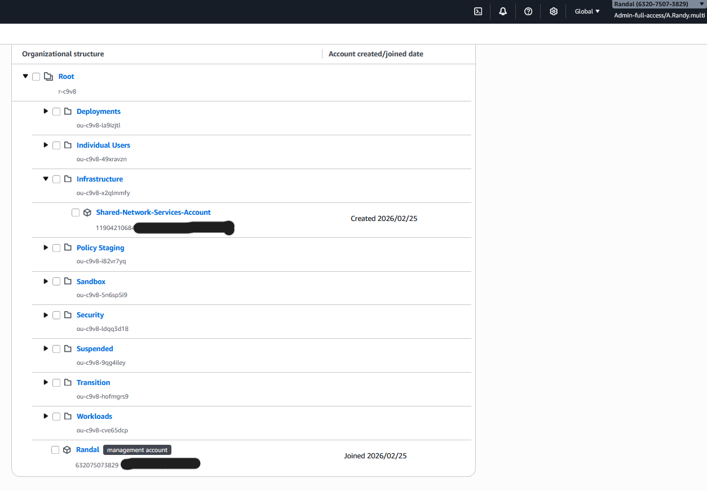
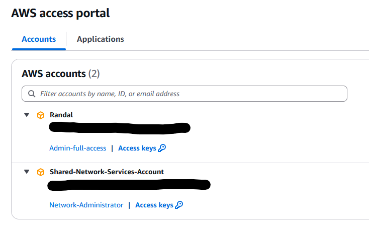
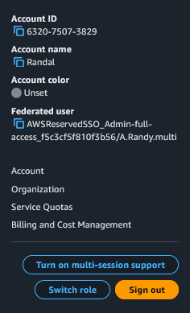

This screenshot shows the **OU structure** and the initial accounts created to support separation of duties and least privilege:
- **Management (MGMT)** account (Randal group) used for organization-level administration and governance.
- **Shared Network Services** account used for shared infrastructure components (networking/security foundations).
- A single administrative identity (**A.Randy.multi**) is used instead of relying on the root user for day-to-day work (aligned with AWS best practices).

---

### Systems Manager access (why I used it)
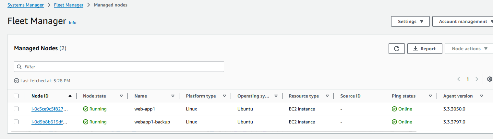
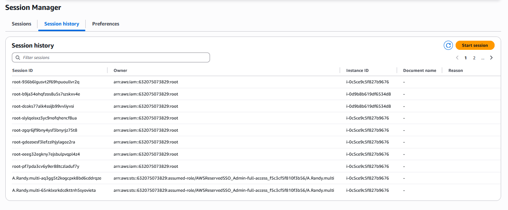
I chose **AWS Systems Manager** to centralize instance management and reduce exposure from direct admin access methods (e.g., inbound SSH/RDP). Key reasons:
- **Just-in-time node access and oversight:** access can be granted only when needed, and session activity can be monitored/recorded (e.g., visibility into interactive access and commands executed during a session).
- **Session Manager** enables secure interactive access without opening inbound management ports.
- Improves **auditability** by recording who accessed which instance and when.
- Supports **patch management** and operational tasks from a centralized console/workflow.

---

### VPC Endpoint Security Group (SSM connectivity)
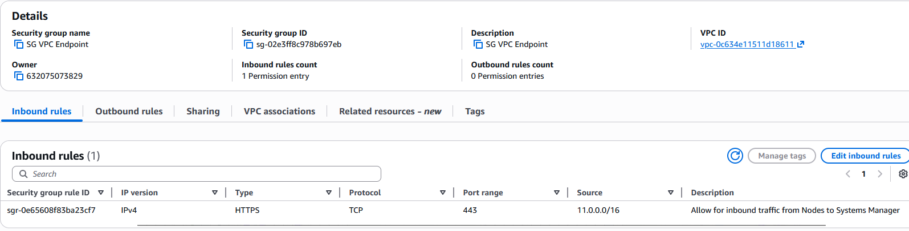
This screenshot also includes the **Security Group** for the Systems Manager VPC Endpoint:
- **Inbound HTTPS (443)** is permitted from within the VPC to allow managed instances to communicate with Systems Manager through the endpoint.
- In a production environment, this rule would be tightened to allow traffic only from the specific **instance security groups** and/or **subnets** that require Systems Manager access, rather than the entire VPC CIDR range.

> Note: Session Manager activity is also logged for accountability.

---

## 2. VPC, Subnets, Endpoints, Routing, SG

### VPC (addressing plan)
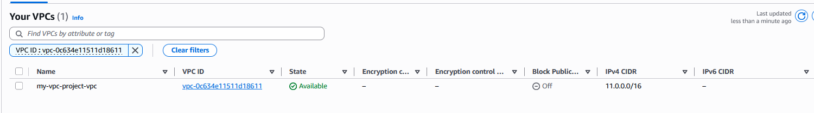
This screenshot shows the VPC created for the project: **`my-vpc-project-vpc`** with CIDR **`11.0.0.0/16`**.

**Why this CIDR range**
- A `/16` provides enough address space to support multiple subnet tiers and future growth.
- Using `11.x.x.x` is an intentional convention so additional VPCs can follow a predictable pattern (e.g., `12.0.0.0/16`, `13.0.0.0/16`) as the organization expands.

---

### Subnets (segmentation across 2 AZs)

The VPC is segmented across **two Availability Zones** with **2 public subnets** and **6 private subnets**.
**Public subnets** (small address space because they host only edge networking resources)
- `11.0.6.0/28` (AZ A)
- `11.0.7.0/28` (AZ B)

**Why /28 for public subnets**
- Public subnets are used primarily for components like NAT/ALB networking and do not require large host capacity.

**Private subnets** (larger address space for application/data growth)
- **Application/EC2 tier**
  - `11.0.0.0/24` (AZ A)
  - `11.0.1.0/24` (AZ B)
- **Web application database tier (RDS)**
  - `11.0.2.0/24` (AZ A)
  - `11.0.3.0/24` (AZ B)
- **Business operations database tier (RDS)**
  - `11.0.4.0/24` (AZ A)
  - `11.0.5.0/24` (AZ B)

**Why /24 for private subnets**
- `/24` provides sufficient IP capacity for scaling instances and services without needing frequent subnet redesign.

---

### Endpoints & Interfaces
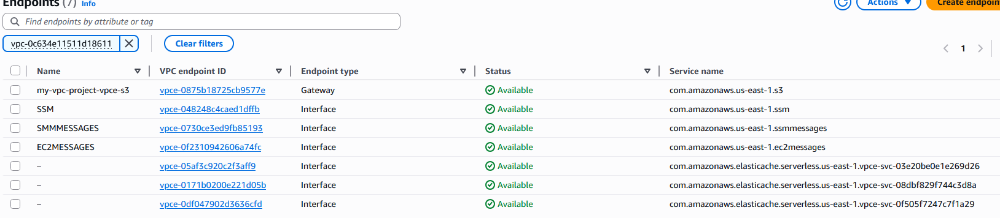
This screenshot shows **7 VPC endpoints** in the VPC. Some were created automatically by AWS as part of enabling/using certain services, and others were created intentionally to support private service access.

### Gateway endpoint (S3)
- **S3 Gateway VPC Endpoint** was created so resources inside the VPC (for example, private EC2 instances) can access **S3 buckets privately** without requiring internet routing for S3 traffic.
- This supports a tighter security posture by keeping S3 access on AWS private networking paths.

### Interface endpoints (Systems Manager)
- **Systems Manager interface endpoints** were created to support private connectivity to Systems Manager services used for EC2 management (Session Manager, patching, and agent communication).
- These interface endpoints deploy **ENIs (elastic network interfaces)** into the subnets, which means they consume private IP addresses in the subnet(s) where they are placed.
- In this design, the endpoints are deployed into the private application subnets (e.g., `11.0.0.0/24` and `11.0.1.0/24`) so managed instances can reach SSM without exposing inbound management ports.

> Note: Interface endpoints consume IPs because each endpoint creates one or more ENIs per subnet. This is one reason subnet sizing (e.g., /24 for private tiers) is useful for future growth.

---

### Security Groups (least privilege boundaries)
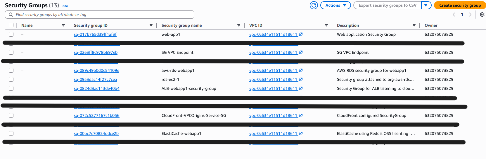
This screenshot shows the Security Groups created to segment access between tiers, including:
- EC2 (application tier)
- RDS (web application and business operations)
- ElastiCache (Redis)
- Application Load Balancer (ALB)
- VPC Endpoint / Systems Manager endpoint security group
- (Planned/unused) CloudFront VPC Origin security group

**Why this matters**
- Security Groups enforce **tier-to-tier access** (e.g., EC2 can reach RDS/Redis, but those services are not open broadly to other subnets/services).

---

### Route tables (controlled traffic flow)
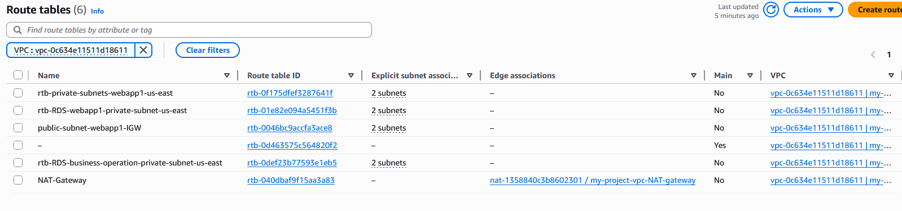
Route tables were created and associated per subnet tier to support intended traffic flows, including:
- **Private-to-private routing** (application tier to data tier, e.g., EC2 → RDS/ElastiCache)
- **Private subnet egress via NAT Gateway** where outbound internet access is required (e.g., OS updates, package/template retrieval)

> Note: Routes are scoped by subnet role to avoid giving all subnets unrestricted internet paths.

---

## 3. Edge Delivery: Route 53 + CloudFront + WAF

### CloudFront (edge delivery) 
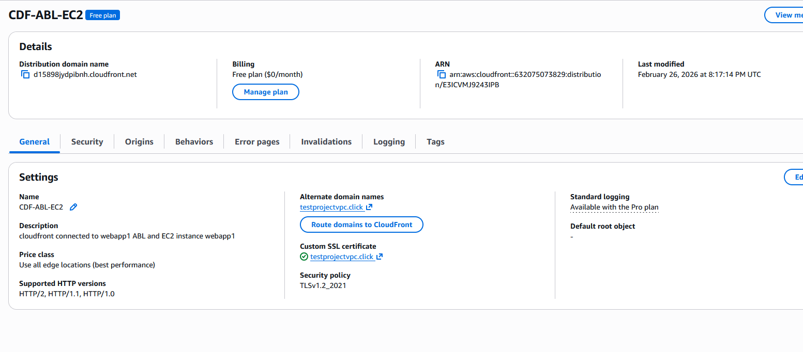
This screenshot shows the **CloudFront distribution** created for the project and confirmation that a **custom SSL/TLS certificate** is attached for the domain **`testmyprojectvpc.click`**.

**Why CloudFront**
- **Performance & scale:** provides global edge caching and improved content delivery as the SaaS expands to more users/regions.
- **Security at the edge:** adds a protective layer in front of the application that helps absorb/mitigate DDoS events and supports attaching **AWS WAF** for web request filtering.
- **Origin protection:** CloudFront helps reduce direct exposure of the origin (application node) by keeping the public entry point at the edge, limiting how/when the origin is accessed and restricitng the numer of requests a user can make to the website within a specific time frame.
- **Strong encryption:** enforces HTTPS and modern TLS for user connections.

---

### DNS (Route 53)
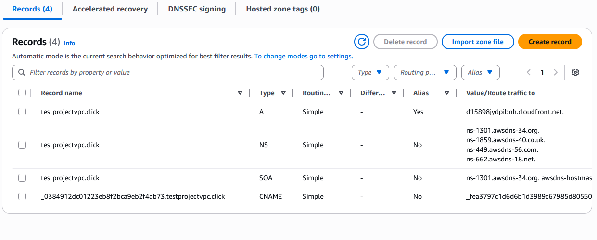
This screenshot shows the **Route 53 DNS records** used to connect AWS services to the custom domain.  
- Alias records are used to route the domain to **CloudFront** and supporting service endpoints (such as the ALB).

---

### Working website HTTPS validation
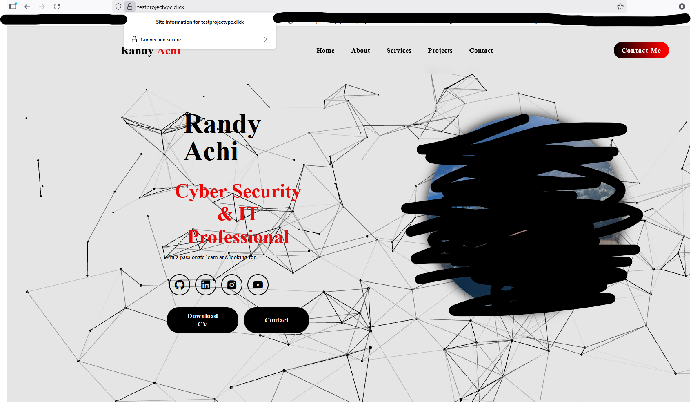
This screenshot confirms:
- The domain is reachable using **HTTPS**
- The TLS certificate is valid
- The page loads successfully (currently hosting portfolio content)

---

## 4. Application Tier: ALB + EC2

### EC2 instances (private subnets)
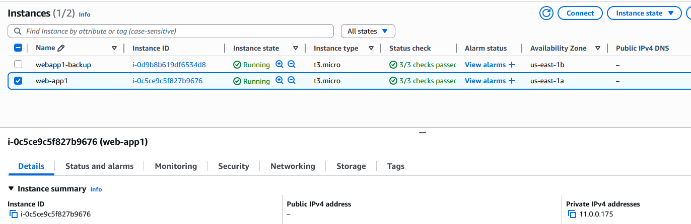
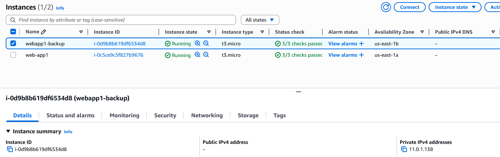

The first screenshot shows the **primary EC2 instance** hosting the web application in the private subnet **`11.0.0.0/24`**.  
The second screenshot shows a **secondary EC2 instance** in **`11.0.1.0/24`** (separate AZ) created for resiliency.
**How the secondary instance was built (AMI-based)**
- I created an **AMI (Amazon Machine Image)** from the primary instance to capture the OS, configuration, and application files/directories.
- The AMI was then used to launch the secondary instance as a consistent, repeatable “golden image” approach.
> Note: This is a simple resilience method for a lab build. In a production SaaS, this would typically evolve into Auto Scaling, CI/CD image pipelines, and immutable deployments.

---

### Inbound traffic (from ALB only)
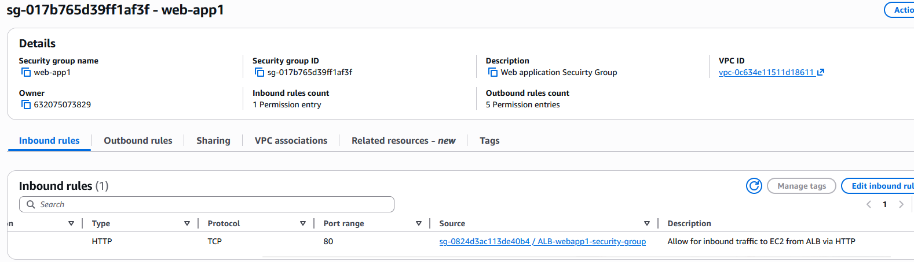
Inbound rules are scoped for **HTTP (port 80)** with the **source restricted to the Application Load Balancer**.

**Why HTTP is used between ALB and EC2**
- ALB ↔ EC2 traffic stays **inside the VPC**, not over the public internet.
- End-user traffic is still protected with **HTTPS at the edge (CloudFront/TLS)**.
- This design keeps the internal communication simple while maintaining encrypted user-facing access.

---

### Outbound traffic (controlled egress)
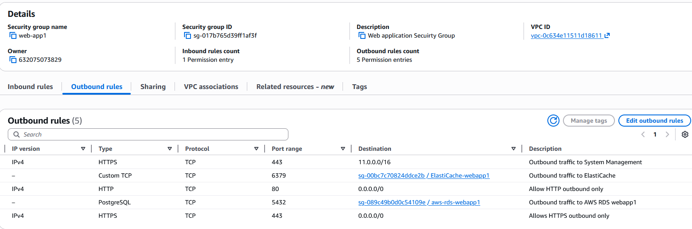
Outbound rules are configured to allow only required destinations/services for the web application tier, including:
- **HTTPS (443) to VPC CIDR `11.0.0.0/16`** for access to internal services such as Systems Manager connectivity paths (where applicable)
- **TCP 6379** to **ElastiCache (Redis OSS)** for cache communication
- **TCP 5432** to **Amazon RDS (PostgreSQL)** for database connectivity
- **HTTP/HTTPS (80/443) to `0.0.0.0/0`** for outbound internet access (updates, patching, required downloads) via NAT Gateway

**Security note**
- In a production environment, broad outbound internet access (`0.0.0.0/0`) should be reduced further (e.g., allowlisting, time-bound access, or a controlled patch/template pipeline). This aligns with the project roadmap to reduce direct internet dependency from application servers.

---

### Application Load Balancer & Security Groups
### ALB overview
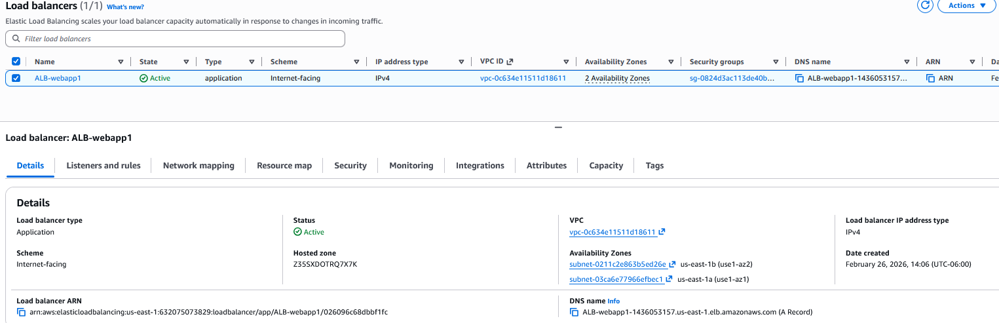
The first screenshot shows the Application Load Balancer **`ALB-webapp1`** and the **Availability Zones** it is associated with. Placing the ALB across multiple AZs supports higher availability and helps avoid single-AZ dependency.

---
### ALB inbound rules (HTTPS from CloudFront)
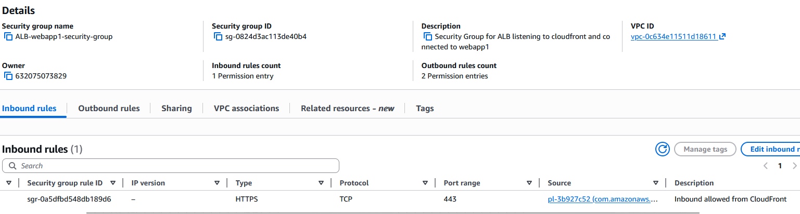
The inbound rules are scoped to allow **HTTPS (443)** traffic **originating from CloudFront**.

**Why this is configured**
- CloudFront is the public edge entry point, so TLS/HTTPS is enforced for secure client connections.
- Restricting inbound traffic only allowing CloudFront, reduces exposure and limits who can reach the ALB directly.

> Note: In a hardened design, the ALB can be kept fully private and reachable only through CloudFront (e.g., VPC Origin model). This project documents that as a future enhancement.

---

### ALB outbound rules (HTTP to EC2 targets)
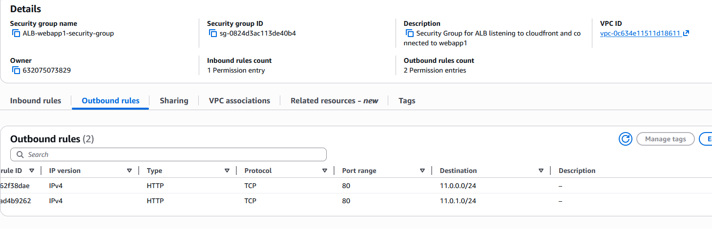
Outbound rules allow the ALB to communicate with the backend EC2 instances over **HTTP (80)**.

**Why HTTP is used between ALB and EC2**
- ALB → EC2 traffic remains inside the VPC.
- TLS is enforced at the edge (CloudFront), while internal traffic is kept simple and controlled via Security Groups.

---

### Target group (where the ALB sends traffic)
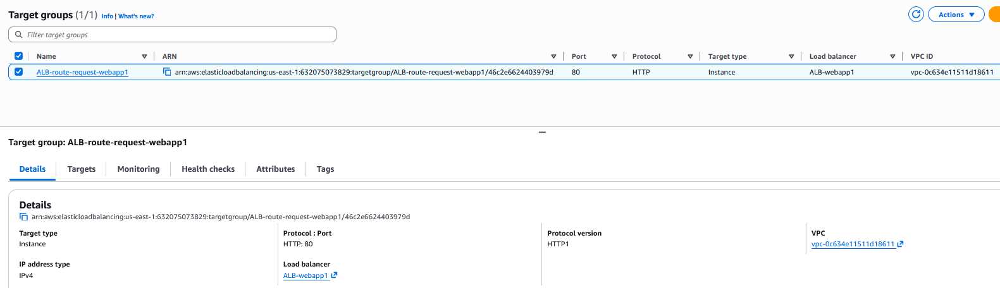
The target group attached to the ALB contains the backend EC2 target, webapp1 on port **80/HTTP**. This is how the ALB knows **where to route requests**.

**Why target groups matter**
- They provide a clean way to route traffic to specific backend services.
- They support health checks and make it easier to scale/replace backend instances without changing the ALB configuration.

---

## 5. Data Layer: RDS + S3 + ElastiCache

### RDS (PostgreSQL databases)
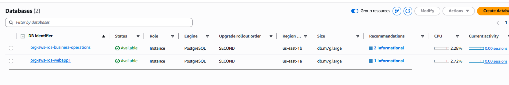
The first screenshot shows the PostgreSQL RDS databases created for this project.

**Design note**
- In a full production environment, this design would typically be expanded to include additional databases (or clusters) to support workload separation (e.g., separate databases for each web application and for business operations, plus redundancy/DR controls).
- For this phase, I implemented a smaller footprint to keep cost and scope reasonable while validating the core architecture.

---

### RDS security groups (least privilege access)
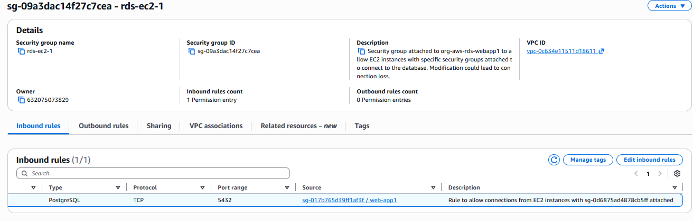
The inbound rules for the web application database allow:
- **PostgreSQL (TCP 5432)** inbound
- **Source restricted to the `web-app1` Security Group**
  
**Why this matters**
- The database is not open to the VPC or the internet.
- Only instances/services that are members of the `web-app1` security group can connect, which enforces least privilege at the network layer.

---
### Connectivity validation (EC2 → RDS using Systems Manager)
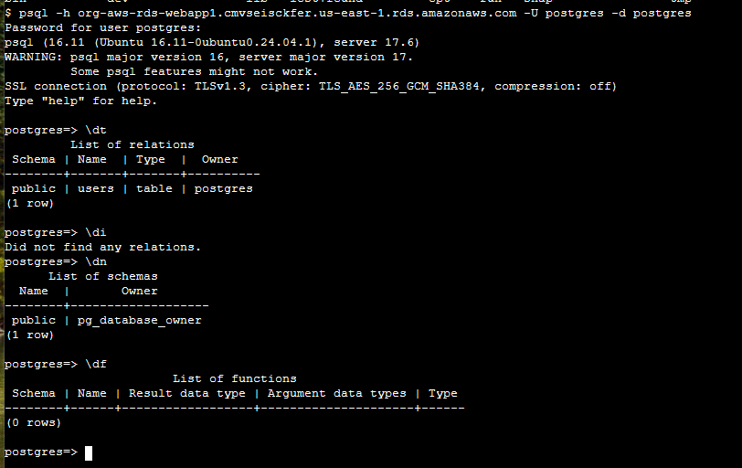
The final screenshot confirms successful connectivity from the private EC2 instance to the private RDS database:
- I accessed the EC2 instance using **AWS Systems Manager Session Manager**
- From that session, I connected to RDS using this command:
**psql -h <RDS-ENDPOINT> -U <USERNAME> -d <DATABASE_NAME>**

---

### S3 buckets (purpose and separation)
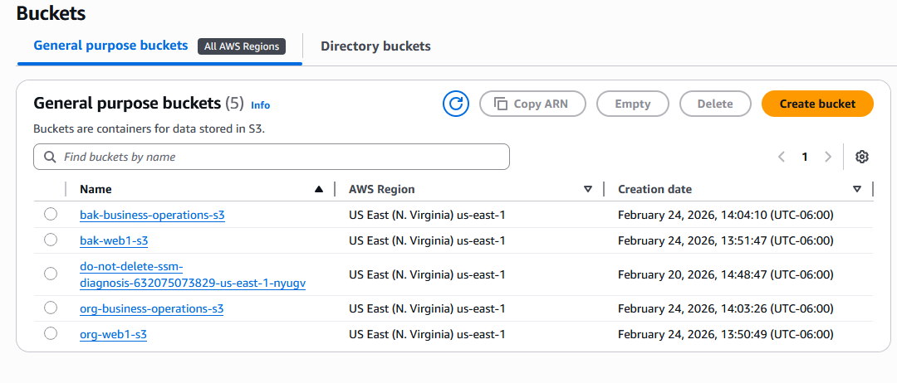
The first screenshot shows **5 S3 buckets** in the account. One bucket was automatically created/used by **Systems Manager**, and the remaining **4 buckets** were created for this project to separate workloads and reduce blast radius:

- **Web application buckets**
  - `org-web1-s3` (primary bucket for WebApp1-related storage)
  - `bak-web1-s3` (backup/redundancy bucket)

- **Business operations buckets**
  - `org-business-operations-s3` (primary bucket for business/operations data)
  - `bak-business-operations-s3` (backup/redundancy bucket)

This separation supports least privilege by ensuring web application workflows do not require access to business operations storage and vice versa.

---
### Bucket policies (least privilege enforcement)
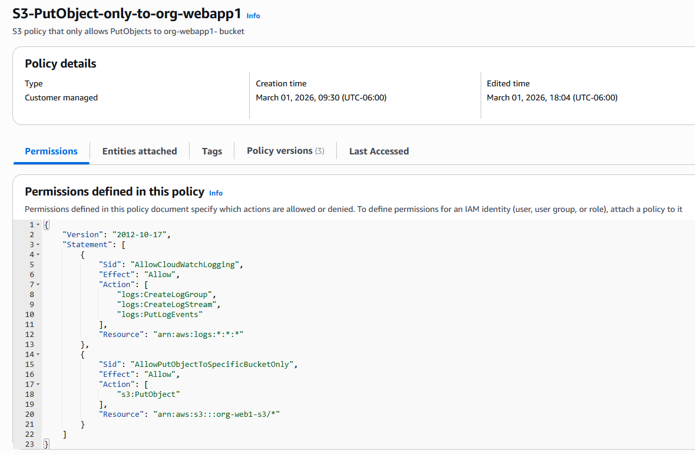
The second screenshot shows an example **S3 bucket policy** used to scope access by workload. In general, these policies are designed so that:
- WebApp1 resources can interact only with the specific web application bucket(s) they need
- Access to unrelated buckets (e.g., business operations buckets) is denied
- Mainly, this access model will be used by the **IOC ingestion workflow** (Lambda function) so ingestion can write to the appropriate bucket (e.g., `org-web1-s3`) without having access to other buckets.

**Why I highlighted bucket listing in the example:**  
In the screenshot example, I intentionally tested bucket listing to illustrate that **without explicit IAM and bucket policy controls**, a workload can end up with broader S3 visibility/access than intended. The policies in this project are therefore designed to **remove unnecessary S3 permissions** and keep access limited to the buckets required for the workload.

---

### Access validation (EC2 → S3)
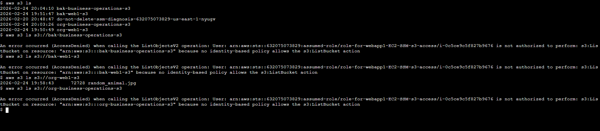
The final screenshot confirms that S3 access controls are working as intended:
- I connected to the EC2 instance using **AWS Systems Manager**
- From the instance, I used AWS CLI commands to verify access, for example I used this command:
**aws s3 ls s3://org-web1-s3**

---

### ElastiCache (Redis OSS) overview
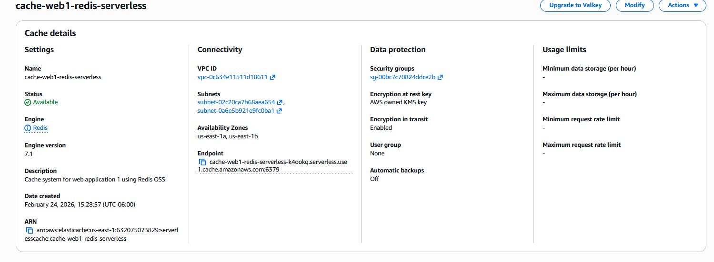
The first screenshot shows the **Redis OSS cache** and the subnet associations aligned to the private application tier (the same private subnets used by the EC2 instances). This keeps cache traffic internal to the VPC, reduces exposure and costs!

---
### Redis security group (restricted access)
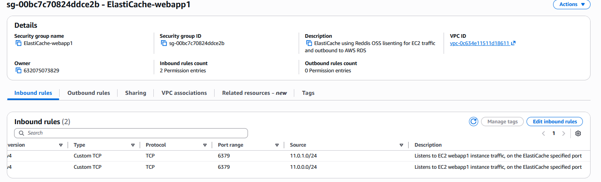
The second screenshot shows the Redis security group rules:
- **Inbound TCP 6379** is allowed **only** from the web application tier (EC2) network range/security boundary.
- This ensures Redis is not reachable broadly from other subnets or public sources.

> From experience, it’s even cleaner to set the Redis inbound source to the **EC2 Security Group** instead of a CIDR range, so only the intended instances can connect even if subnets change.

---
### Connectivity validation (EC2 → Redis using Systems Manager)
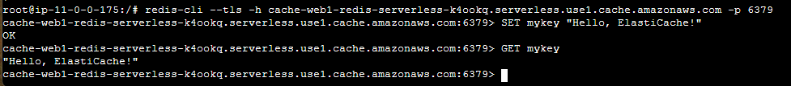
The final screenshot confirms successful connectivity from a private EC2 instance to Redis:
- I connected to the EC2 instance via **AWS Systems Manager (SSM)**
- Then I used `redis-cli` to connect and set a test value, using this command:
**redis-cli --tls -h <endpointname> -p 6379**

---

---

## Future Enhancements

### Automation: EventBridge + Lambda - In Progress

---

### Scheduled automation (EventBridge)
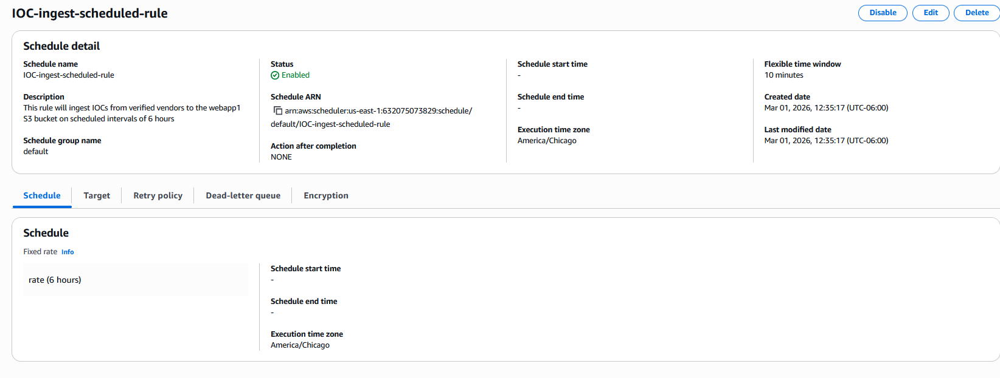
### Scheduled automation (EventBridge)
The first screenshot shows an **EventBridge schedule** configured to run on a recurring basis (every **6 hours**).  
I chose EventBridge because it provides a reliable way to trigger time-based automation without managing servers or cron jobs.

**Why this matters**
- EventBridge can be used for many operational tasks beyond ingestion, such as:
  - initiating patching workflows
  - running health checks
  - triggering operational or security automation on a schedule
Making sense to use it in testing than exposing it to a production setting.

---

### IOC ingestion function (Lambda) — in progress
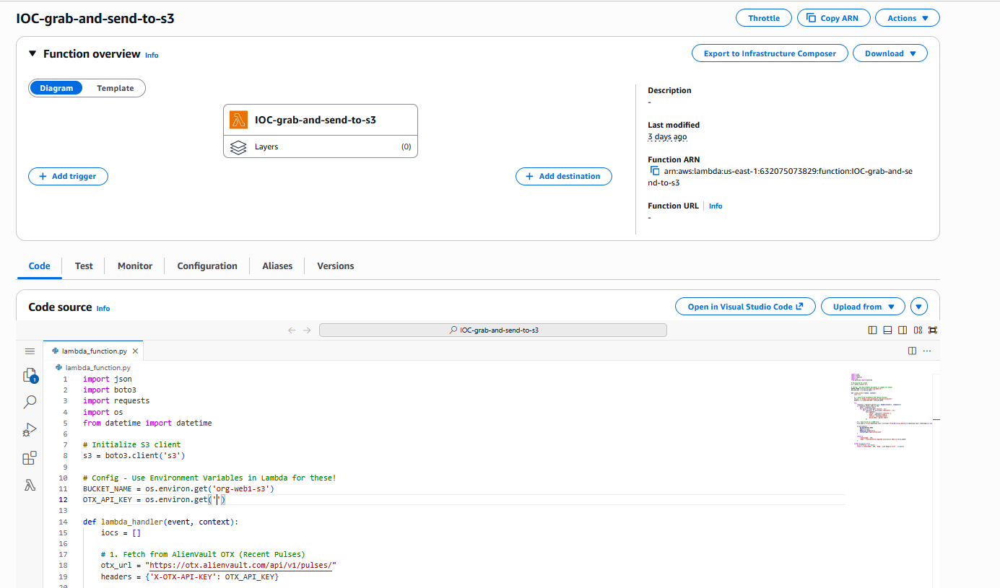
The second screenshot shows a Lambda code snippet intended to:
- fetch IOCs from a trusted threat-intel source (e.g., AlienVault OTX)
- store the retrieved data in the **`org-web1-s3`** bucket for the web application workflow

**Why Lambda**
- Lambda is lightweight and versatile for automation tasks such as:
  - ingesting threat intelligence feeds
  - transforming/normalizing data before storage
  - forwarding logs/events to a centralized location
  - triggering alerting workflows
Making Lambda a versatile tool for most automotive use cases.
> **Status:** The EventBridge rule and Lambda function exist, but the ingestion workflow is still in progress and not yet fully operational.

---

### Monitoring, auditing, and security posture — in progress
Security and operational visibility is a key part of the target-state design. Many AWS services already generate useful telemetry by default (for example):
- EC2 health checks and instance-level monitoring
- Systems Manager session history/activity

The next step is to **centralize logging and enable governance controls** so the environment can scale safely, including:
- centralized log storage (single location for audit + troubleshooting)
- detection and alerting for abnormal behavior
- configuration compliance checks and guardrails
Hence, the reason we went with the setup in the Architecture section which allows us to pull all our monitoring into one spot, and for threat intelligence detection. This helps us keep a closer eye on things and really strengthens our overall security posture

As the organization grows, implementing **AWS Control Tower** helps establish this consistent governance baselines and guardrails across accounts, making it easier to scale compliance and security controls over time.

> These monitoring/auditing/security services are planned enhancements and will be implemented incrementally as the project evolves.
