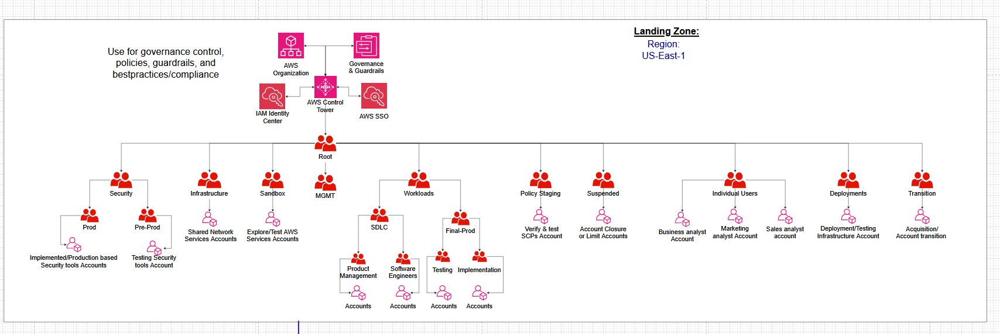
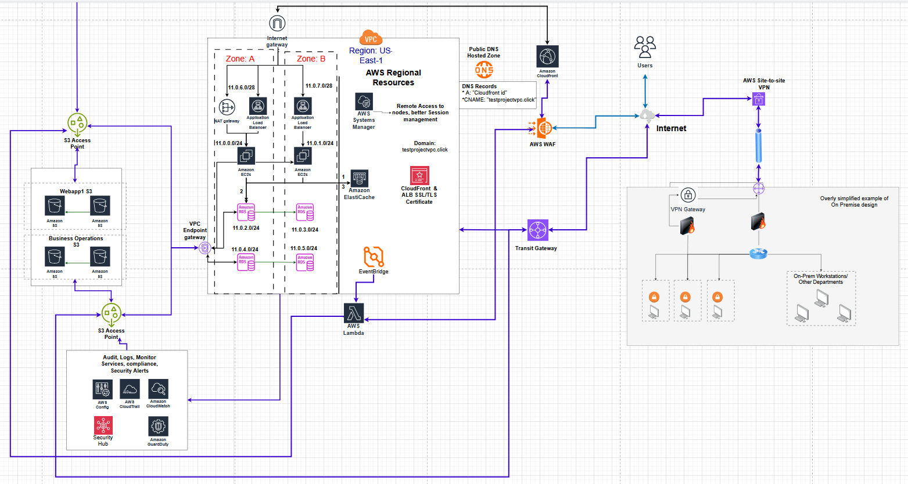
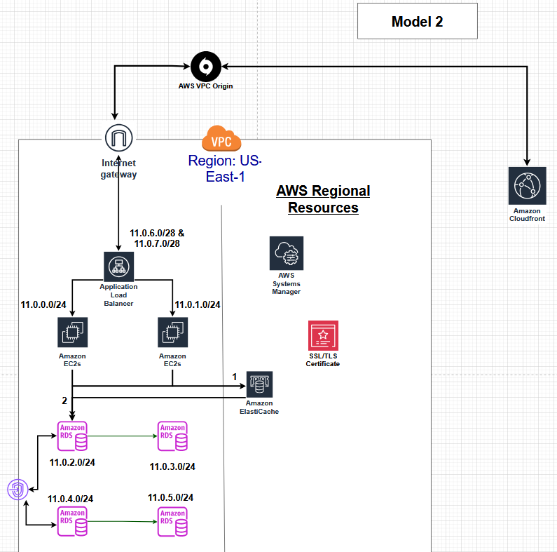

# AWS-network-infrastructure-project
A secure, scalable cloud network architecture for a small-to-medium organization, designed for future expansion and hybrid interoperability (cloud and on-premises). The design follows least-privilege access and a layered defense-in-depth security model.

## Table of Contents
- [Project Overview & Scenario](#project-overview-scenario)
- [Implemented vs Planned](#implemented-vs-planned-current-state-vs-target-state)
  - [Implemented Currently](#implemented-currently)
  - [Planned or Future Implementations](#planned-future-implementations)
- [Architecture](#architecture)
- [Walkthrough](#walkthrough-screenshots)
  - [1. AWS Organizations & OUs](#1-aws-organizations--ous)
  - [2. VPC, Subnets, Routing](#2-vpc-subnets-routing)
  - [3. Edge Delivery: Route 53 + CloudFront + WAF](#3-edge-delivery-route-53--cloudfront--waf)
  - [4. Application Tier: ALB + EC2](#4-application-tier-alb--ec2)
  - [5. Data Layer: RDS + S3 + ElastiCache](#5-data-layer-rds--s3--elasticache)
  - [6. Automation: EventBridge + Lambda - In Progress](#6-automation-eventbridge--lambda-in-progress)
  - [7. Monitoring & Audit - Planned Enhancements](#7-monitoring--audit-planned-enhancements)
- [Future Enhancements](#future-enhancements)

---

## Project Overview & Scenario 
This project models a small (growing) US-based tech company building a threat-intelligence SaaS similar to Talos/VirusTotal. The goal is to implement a secure, scalable AWS foundation with hybrid-readiness for future expansion. While this repo does not deliver a full production application or complete threat-intel database, the core infrastructure is deployed, functional, and designed to support a full SaaS implementation.

### NOTE
Some components shown in the target-state design were intentionally **not implemented** in this phase to keep costs reasonable while still building a secure, scalable foundation. Services such as **Transit Gateway** and **Direct Connect Gateway** improve performance and hybrid scalability, but they are typically introduced when an organization grows, hybrid traffic increases, or measurable network bottlenecks appear.

For the same cost-conscious reasons, I did not implement higher-cost enhancements such as a CloudFront **VPC Origin** model. Additionally, while **production-grade database deployments (e.g., Amazon RDS)** are commonly configured with redundancy measures (such as **Multi-AZ**, read replicas, and backup/restore strategies), I did not implement full redundancy in this project due to limited resources and the cost of managed database scaling. In a real-world environment, **database redundancy and recovery controls would be required** to support availability and business continuity.

This project is primarily focused on **learning and demonstrating AWS best practices** by building a suitable cloud environment that supports **scalability, security, and business continuity** with a low initial operating cost. A more fully featured SaaS implementation (including complete ingestion, application logic, and production-grade hardening) is planned as a future phase.

---

## Implemented vs Planned (Current State vs Target State)

This project documents both the **current implemented AWS foundation** and the **target-state architecture** for a growing threat-intelligence SaaS. The infrastructure is functional and designed for future expansion, even though not all target services are deployed yet.

## Implemented Currently

### Governance & access
- **AWS Organizations** created with **OU separation** to support environment/team isolation
- **IAM** policies/permissions applied to support **least privilege**
- **Security Groups** configured for all deployed resources (EC2, ALB, RDS, ElastiCache, etc.)
- **AWS Systems Manager (SSM)** enabled for secure instance management (no inbound admin access required)

### Core networking
- **VPC** deployed across **2 Availability Zones**
- **8 subnets** created, 2 public and 6 private (segmented network layout)
- **Internet Gateway (IGW)** attached for required internet connectivity paths
- **NAT Gateway** implemented for controlled outbound connectivity where required
- **Route tables** configured to control traffic between subnets, endpoints, and internet access as needed
- **VPC Gateway Endpoint** implemented for private access from VPC workloads to supported AWS services

### Application delivery
- **EC2 instances** deployed for the application tier behind an **Application Load Balancer (ALB)**
- **CloudFront distribution** implemented as the public edge entry point
- **Route 53 hosted zone / DNS** configured for the domain
- **NAT Gateway egress design (current approach):** one NAT Gateway is used to allow **outbound-only HTTP/HTTPS** access from EC2 nodes for OS updates/upgrades and retrieving required web templates/dependencies (no inbound management access)

### Functional connectivity
- Verified **working connectivity** from the EC2 application tier to required AWS resources, including:
  - **Amazon RDS** (web application and business operations databases)
  - **Amazon S3** buckets (workload-specific access via policies)
  - **Amazon ElastiCache (Redis OSS)** for caching (private connectivity within the same region/VPC routing model)

### Caching layer
- **Amazon ElastiCache (Redis OSS)** deployed as a **serverless** cache
  - This means the cache is managed by AWS and **not hosted in my own private subnets**
- Connectivity validated by successfully connecting from a **private EC2 instance** in the same region/VPC environment

### Data & storage separation
- **4 Amazon RDS databases** deployed in private subnets, separated by function:
  - **2 RDS** for the **web application** workload (EC2/webapp tier)
  - **2 RDS** for **business operations** (internal ops + future log/security data use cases)
- **4 S3 buckets** deployed, separated by function:
  - **2 buckets** aligned to **web application** storage needs
  - **2 buckets** aligned to **business operations** and **future log/security storage**
- **S3 policies and scoped permissions** applied to prevent broad bucket access across workloads (foundation for future S3 Access Points)

### Automation (partial)
- **EventBridge rule** created to schedule ingestion runs
- **Lambda function** created, but **IOC ingestion is not yet fully functional** (workflow staged but not complete)

### Application logic scope note
- This repository focuses on the **infrastructure foundation** (networking, routing, security controls, and managed service deployment).
- While RDS and ElastiCache are deployed and reachable, the **application/database/cache logic** (schemas, query handling, cache key strategy, data access layer, request handling, etc.) is not yet implemented and will be developed in a future phase.

--

## Planned or Future Implementations

### Landing zone standardization
- **AWS Control Tower**: automate account baselines/guardrails and streamline multi-account management

### Hybrid connectivity
- **Transit Gateway (TGW) + Site-to-Site VPN**: Enables hybrid (on-prem ↔ AWS) connectivity with centralized routing, and provides a scalable hub-and-spoke design that can connect multiple VPCs as the organization expands.
- **Direct Connect Gateway + Transit VIF**: Planned future upgrade for higher-performance hybrid connectivity. This provides more consistent bandwidth and lower-latency connectivity for sustained, high-throughput communication between on-premises environments and AWS as reliance on hybrid operations grows.

### Security posture & detection
- **AWS Config**: configuration compliance and drift detection
- **Amazon GuardDuty**: managed threat detection
- **AWS Security Hub**: centralized findings aggregation and posture reporting
- (Optional) **VPC Flow Logs**: deeper network visibility and troubleshooting

### More secure patch/template sourcing (reducing NAT dependency)
- Introduce a **hardened “workforce”/patch-fetcher system** connected to the AWS environment via **VPN** (or equivalent secure access path)
- This system acts as a controlled downloader for OS patches, application templates, and required dependencies
- Downloaded artifacts are stored in a dedicated **S3 bucket** and made available to **WebApp1** via tightly scoped policies and/or **S3 Access Points**
- This reduces direct internet retrieval from application servers and supports stronger supply-chain controls

### Granular storage access
- **S3 Access Points**: enforce workload- and application-specific access boundaries at scale (beyond bucket-level policies)

### IOC ingestion + serving layer
- Complete ingestion workflow: **EventBridge → Lambda → S3 (raw snapshots) → DynamoDB (serving lookup layer)**
- (Optional) **DynamoDB Global Tables / multi-region expansion** as the SaaS scales

### Private-origin hardening (cost vs security model)
- Implement the **CloudFront VPC Origin model** (private origin access) as a future improvement; current build uses **NAT** for cost reasons

## Architecture

- using VPC Origin will allow for bettere secuirty, and allow Amazon CloudFront to deliver content from applications in private AWS subnets. Eliminates the need for public-facing load balancers, NAT gateways, or complex firewall rules.

## Walkthrough

## 1. AWS Organizations & OUs

## 2. VPC, Subnets, Routing

## 3. Edge Delivery: Route 53 + CloudFront + WAF

## 4. Application Tier: ALB + EC2

## 5. Data Layer: RDS + S3 + ElastiCache

## 6. Automation: EventBridge + Lambda - In Progress

## 7. Monitoring & Audit - Planned Enhancements

## Future Enhancements
